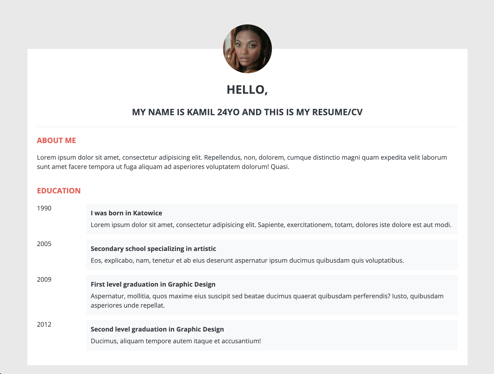

# Basic Quiz 前端需求说明


1. 按照效果图完成需求，通过访问`http://localhost:1234/users/${id}`可查看用户基本信息和教育信息
1. 若无用户数据，可不做特殊处理，页面显示原始HTML，不去渲染用户信息

## 代码规范要求
1. 使用语义化HTML
1. 使用Sass，样式值可依据`src/style/_variables.scss`
1. 添加jest单元测试
1. 小步提交，至少3个提交，提交信息要表意
1. (**扩展**)可以使用Json Server访问模拟数据做调试
    
    - 启动Json Server（参加Setup 3）
    - `http://localhost:3000/users/1`获取user基本信息
    - `http://localhost:3000/users/1/educations`获取user教育信息
1. (**扩展**)操作DOM可使用jQuery
    **设置元素的内容**

    ```javascript
    $('#id').html("value");
    ```
    
    **在元素结尾插入内容**
    
    ```javascript
    const item = 'Item 1';
    $('ul').append(`<li>${item}</li>`)
    ```
    
    **设置图片src**
    ```javascript
    $("img").attr("src", imageUrl);
    ```
1. (**扩展要求！**)通过eslint测试（命令参加Setup 4） 

## 命令行脚本

1.安装包依赖

```
npm install
```

2.启动服务 `http://localhost:1234`，更新文件会实时加载

```
npm start
```

3.启动Json Server `http://localhost:3000`
```
npm run server
```

4.代码风格检测：

```
npm run lint
```

5.运行测试
```
npm run test
```
```
npm run test:watch
```
```
npm run test:coverage
```
